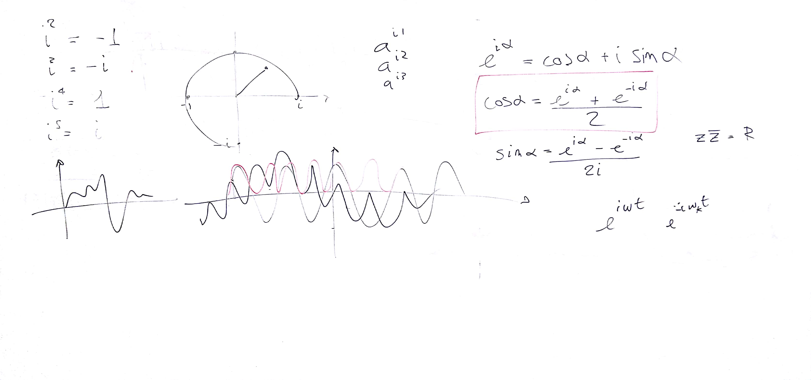

# Lezione del 10 gennaio 2018

## Argomenti

* Ripasso generale:
  * approfondimenti sulla formula di Eulero
* Introduzione alla scomposizione in serie di Fourier
  * concetti fondamentali (con verifica `octave`)
  * *Discrete Fourier Transform* con un segnale complesso (centrato su una frequenza/bin)
  * *Discrete Fourier Transform* con un segnale complesso (**non** centrato su una frequenza/bin)
  * *Discrete Fourier Transform* con un segnale reale (centrato su una frequenza/bin)
  * *Discrete Fourier Transform* con un segnale reale (**non** centrato su una frequenza/bin)

