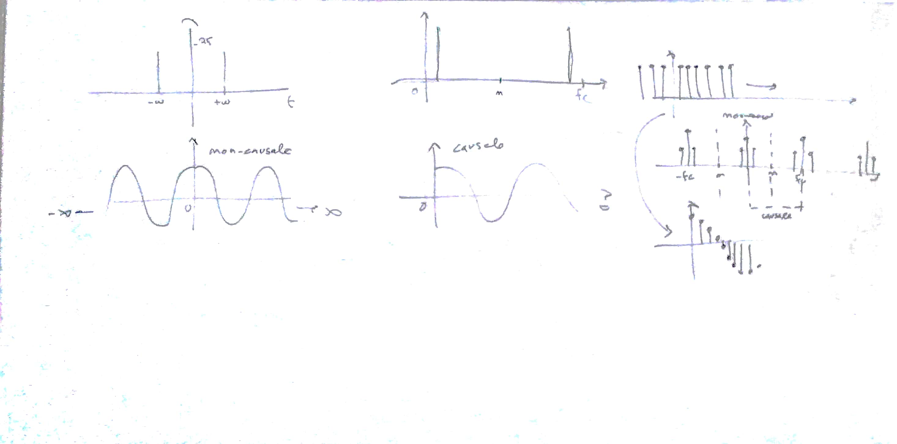
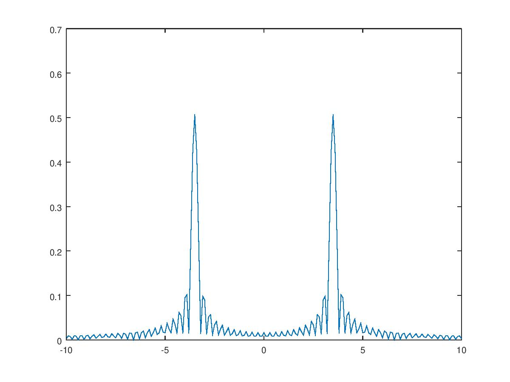
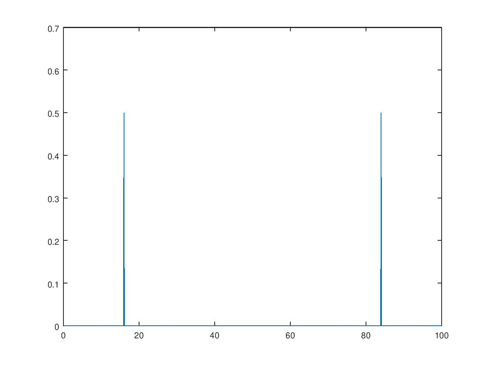

# Lezione del 24 gennaio 2018

## Argomenti

* Ripasso generale:
  * approfondimenti sulla formula di Eulero
  * DFT reale con frequenza precisa e non precisa



## DFT con frequenza non precisa

[DFT_E1.m](./DFT_E1.m)
```matlab
w = 3.5;
t = [-10:0.1:10];

z = cos(w*t);

F = [-10:0.1:10];

dft = zeros(size(F));

for k = 1:size(F, 2)
fa = F(k);
za = z.*e.^(-i*fa*t);
dft(k) = abs(sum(za))/size(t, 2);
end

plot(F, dft);
```



## DFT con frequenza precisa

[DFT_E2.m](./DFT_E2.m)
```matlab
fc = 100; %frequenza di campionamento in Hz

SampInc = 1/fc;	

f = 16;%Hz

w = f*2*pi;

t = [0:SampInc:100];

z = cos(w*t);

BinSize = 0.1; 

F = [0:BinSize:fc-BinSize];

dft = zeros(size(F));

for k = 1:size(F, 2)
wa = F(k)*2*pi;
za = z.*e.^(-i*wa*t);
dft(k) = abs(sum(za))/size(t,2);
end

plot(F, dft);
```



