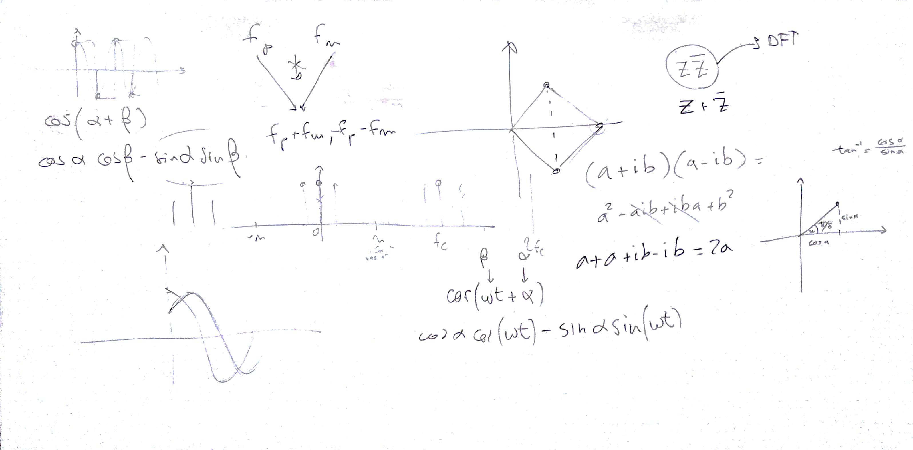
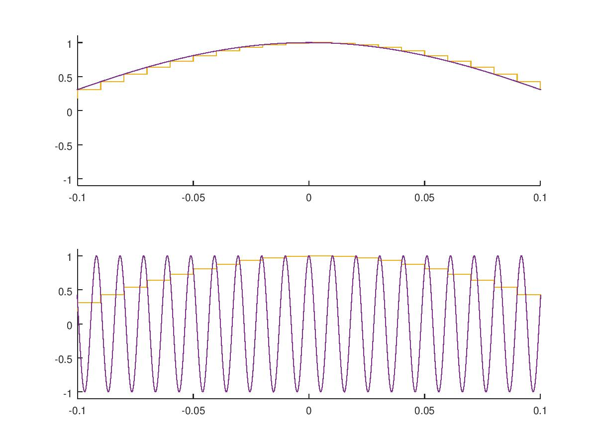
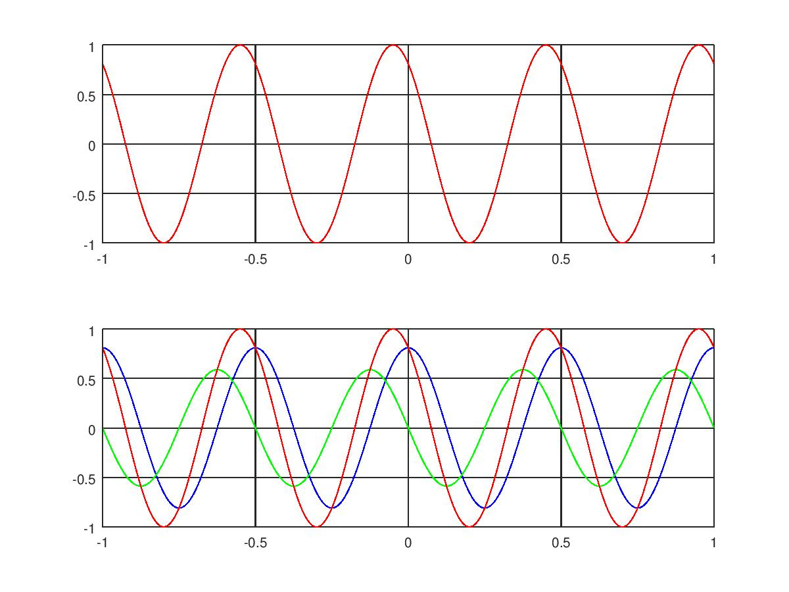

# Lezione del 31 gennaio 2018

## Argomenti

* Introduzione alla scomposizione in serie di Fourier
  * Ruolo dei parametri (*window size*, *bin size*, risoluzione temporale, risoluzione frequenziale)
  * Finestratura del segnale - errori e approssimazioni
  * *Zero-padding*



## Aliasing

[aliasing.m](./aliasing.m)
```matlab
fc1 = 100;
fc2 = 10000;
pc1 = 1/fc1;
pc2 = 1/fc2;
dur = 2;
t1 = [-dur/2:pc1:dur/2-pc1];
t2 = [-dur/2:pc2:dur/2-pc2];
n = fc/2;
dif = 48;
f1 = n-dif;
f2 = n+dif;
y11 = cos(t1*f1*2*pi);
y12 = cos(t1*f2*2*pi);
y21 = cos(t2*f1*2*pi);
y22 = cos(t2*f2*2*pi);

subplot(2, 1, 1);
hold on
stairs(t1, y11);
plot(t2, y21);
axis([-0.1 0.1 -1.1 1.1])
hold off
subplot(2, 1, 2);
hold on
stairs(t1, y12);
plot(t2, y22);
axis([-0.1 0.1 -1.1 1.1])
hold off

print('aliasing.jpg', '-djpeg');
```


##Somma trigonometrica

[somma_trig.m](./somma_trig.m)
```matlab
%DFT con numeri reali
fc = 1000;
pc = 1/1000;
dur = 2;
t = [-dur/2: pc: dur/2-pc];
f = 2;
w = f*2*pi;
phi = pi/5;
y = cos(w*t+phi);

ycos = cos(phi)*cos(w*t);
ysin = -sin(phi)*sin(w*t);

ysomma = ycos.+ysin;

subplot(2, 1, 1);
plot(t, y, 'r');
grid on
subplot(2, 1, 2);
plot(t, ycos,'b', t, ysin,'g', t, ysomma,'r');
grid on

print('somma_trig.jpg', '-djpeg');
```

