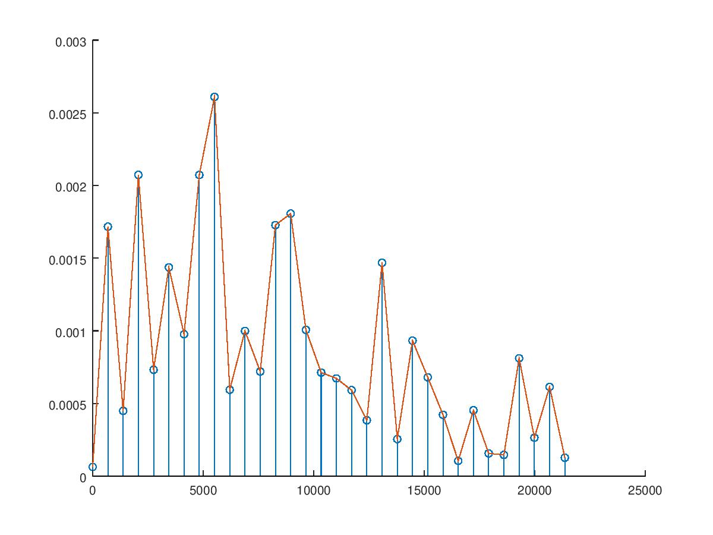
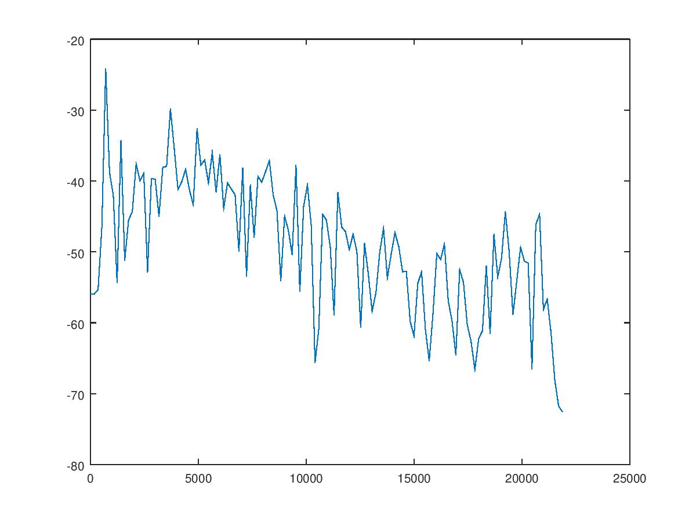
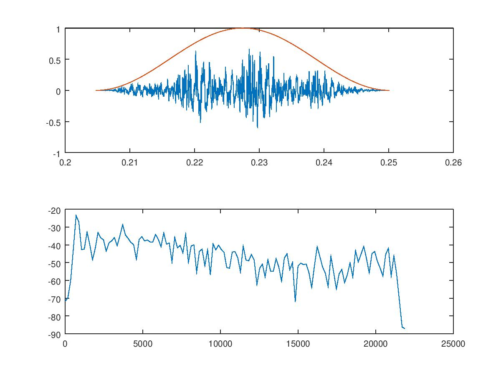

# Lezione del 31 gennaio 2018

## Argomenti

* Scomposizione in serie di Fourier di un segnale reale
  * Ruolo dei parametri (*window size*, *bin size*, risoluzione temporale, risoluzione frequenziale)
  * Finestratura del segnale - errori e approssimazioni
  * *Zero-padding*


## DFT di un campione

[DFT_E1g.m](./DFT_E1.m)
```matlab
clear all
close all

[y, fs] = audioread('../audio/ring.wav'); %vettore y, freq.camp fs

pc = 1/fs;
nSamp = size(y, 1);
dur = pc*nSamp;

t = [0:pc:dur-pc]';

%normalizzazione del segnale y 
y = y*(1/max(y))*(10^(-(1/20))); %

winSize = 64;
binSize = fs/winSize

%Rotazione del vettore (con l'apice finale)
F = [0:binSize:fs-binSize]'; %da vettore riga a vettore colonna

for k = 1:size(F, 1)/2
fa = F(k)*2*pi;
za = y.*e.^(-i*fa*t);
dft(k, 1) = (abs(sum(za))/size(t,1))*2;
end
 
stem(F(1:size(dft, 1),1), dft);
hold on
plot(F(1:size(dft, 1),1), dft);
hold off
```


## DFT di una porzione del campione

[DFT_E2.m](./DFT_E2.m)
```matlab
clear all
close all

[y, fs] = audioread('../audio/ring.wav'); 

pc = 1/fs;
nsamp = size(y, 1);
dur = pc*nsamp;

t = [0:pc:dur-pc]';

%creazione della finestra della DFT
tWinSize = 2000; %grandezza in campioni
tWin = [floor(size(y, 1)/4) floor(size(y, 1)/4)+tWinSize];
y = y*(1/max(y))*(10^(-(1/20))); 
yW = y(tWin(1):tWin(2),1); %porzione segnale y analizzato
tW = t(tWin(1):tWin(2),1);

winSize = 250;
binSize = fs/winSize

F = [0:binSize:fs-binSize]'; 

for k = 1:size(F, 1)/2
fa = F(k)*2*pi;
za = yW.*e.^(-i*fa*tW);
dft(k, 1) = (abs(sum(za))/size(tW,1))*2;
end
 
% visualizzazione DFT in dB
dBdft = 20*log10(dft); 

plot(F(1:size(dft, 1),1), dBdft);
```


## DFT con *finestra di Hann*

[DFT_E3.m](./DFT_E3.m)
```matlab
clear all
close all

[y, fs] = audioread('../audio/ring.wav'); 

pc = 1/fs;
nsamp = size(y, 1);
dur = pc*nsamp;

t = [0:pc:dur-pc]';

tWinSize = 2000;;
tWin = [floor(size(y, 1)/4) floor(size(y, 1)/4)+tWinSize-1];
y = y*(1/max(y))*(10^(-(1/20))); 

%creazione finestra di Hann
Hann = -0.5*cos((2*pi/tWinSize)*(0:tWinSize-1))'+0.5;

yW = y(tWin(1):tWin(2),1).*Hann; 
tW = t(tWin(1):tWin(2),1);

winSize = 250;
binSize = fs/winSize

F = [0:binSize:fs-binSize]'; 

for k = 1:size(F, 1)/2
fa = F(k)*2*pi;
za = yW.*e.^(-i*fa*tW);
dft(k, 1) = (abs(sum(za))/size(tW,1))*4;
end
 
dBdft = 20*log10(dft); 

subplot(2, 1, 1)
plot(tW, yW, tW, Hann);
subplot(2, 1, 2)
plot(F(1:size(dft, 1), 1), dBdft);
```


