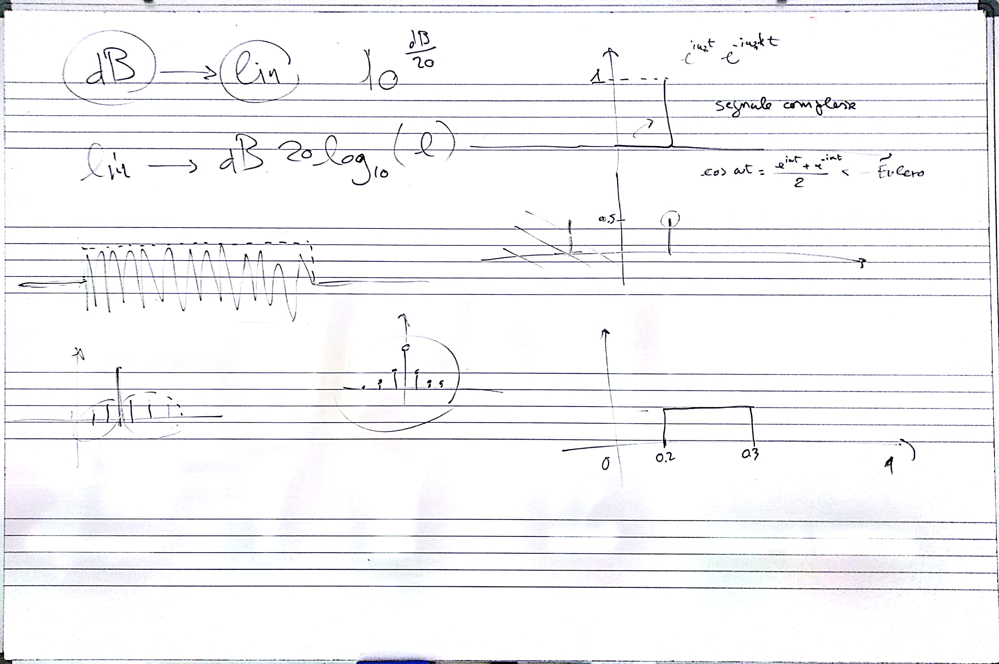
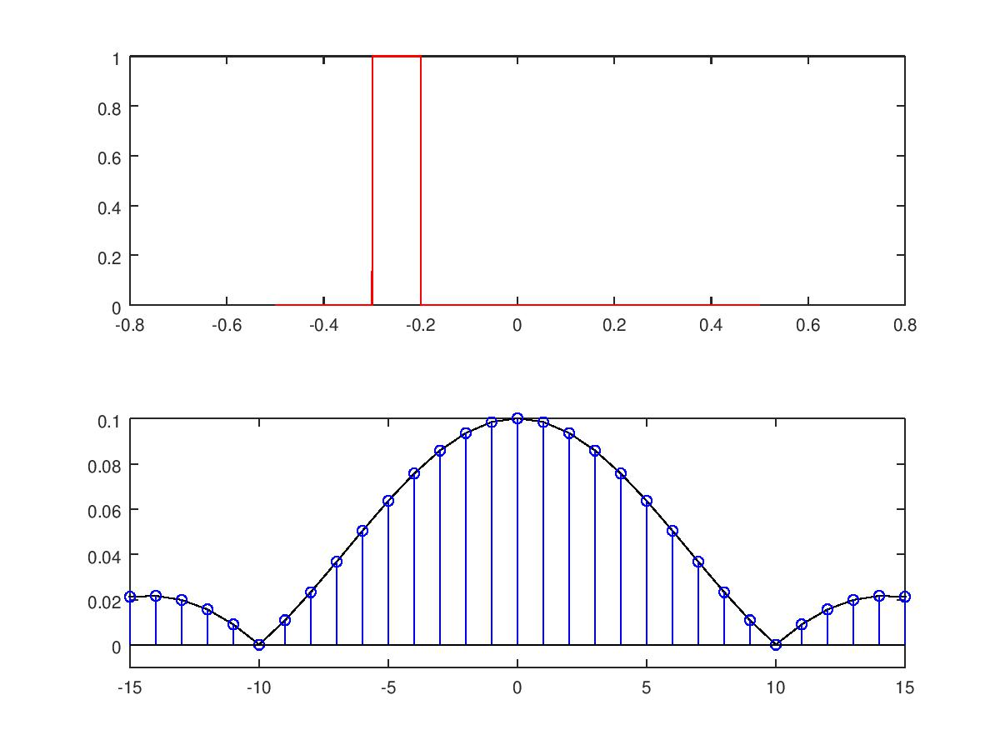

# Lezione del 21 marzo 2018

## Argomenti

* Scomposizione in serie di Fourier di un segnale reale
  * Finestratura del segnale - errori e approssimazioni
  * *Zero-padding*



## window DFT

[Win1.m](./Win1.m)
````matlal
clear all
close all

sr = 10000; %Sample Rate
pc = 1/sr;

durBig = 1; %sec
durSmall = 0.1; % durata della finestra
SmallOffSet = 0.2; % inizio della finestra 

dSS = floor(durSmall*sr); %duarata in campioni della finstra (dur Small Sample)
dSO = floor(SmallOffSet*sr); %OffSet in campioni della finestra

t = [-durBig/2:pc:(durBig/2)-pc]; %array tempo

% generazione della finestra y 
y = zeros(1, size(t, 2));
y(dSO:dSO+dSS) = 1;

winSize = floor(durBig*sr);
binSize = sr/winSize;

F = [-winSize/2:binSize:(winSize/2)-binSize];

% DFT della finestra
for k = 1:size(F, 2);
fa = F(k)*2*pi;
za = e.^(-i*fa*t);
ya = y.*za;
dft(k) = abs(sum(ya))/size(ya, 2);
end

subplot(2, 1, 1)
plot(t, y, 'r')
subplot(2, 1, 2)
plot(F, dft, 'k')
hold on
stem(F, dft, 'b')
axis([-15 15 -0.01 0.1])
hold off
```

