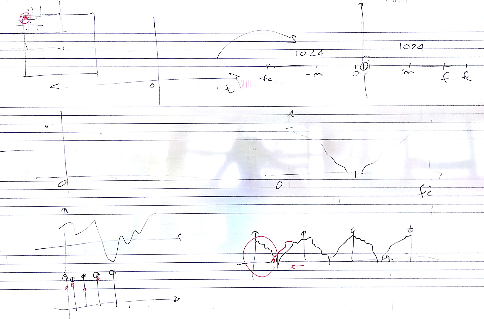
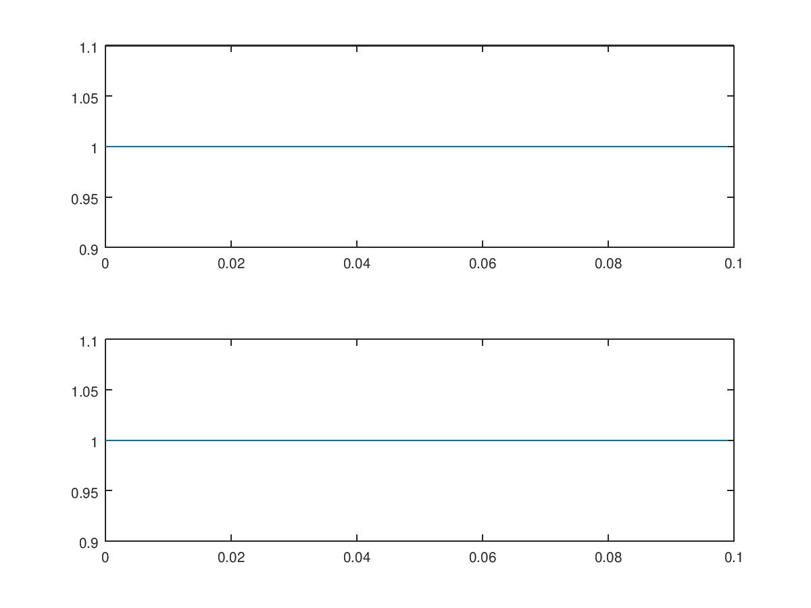
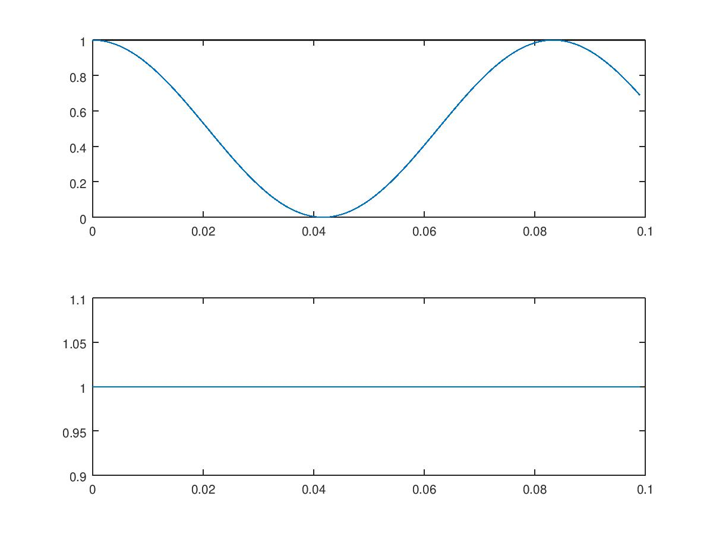
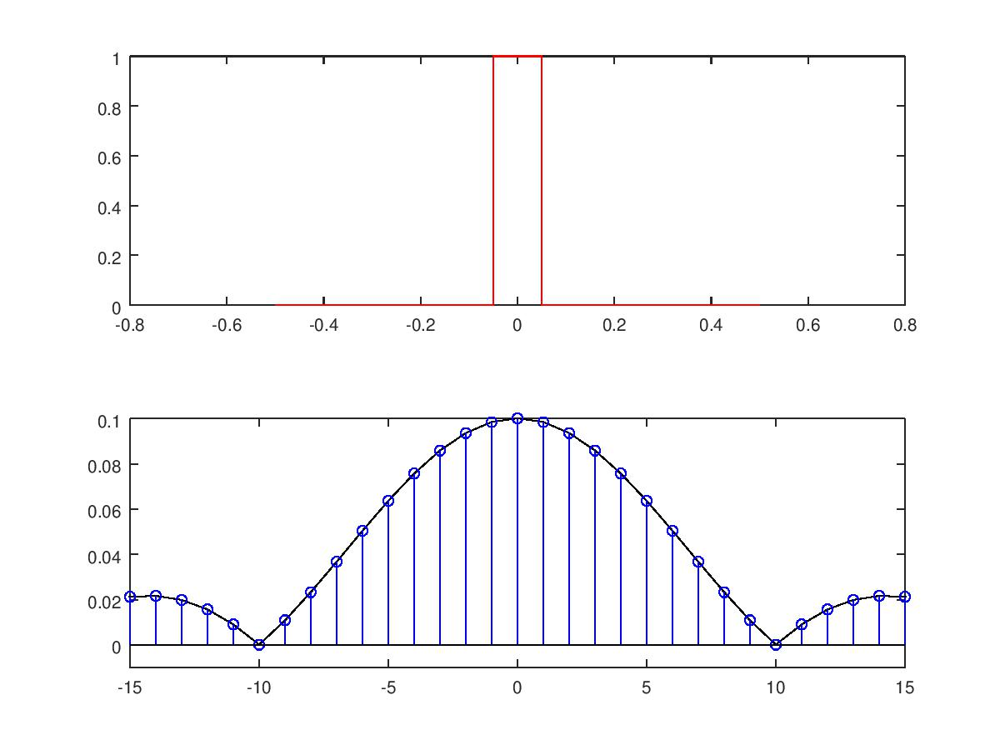
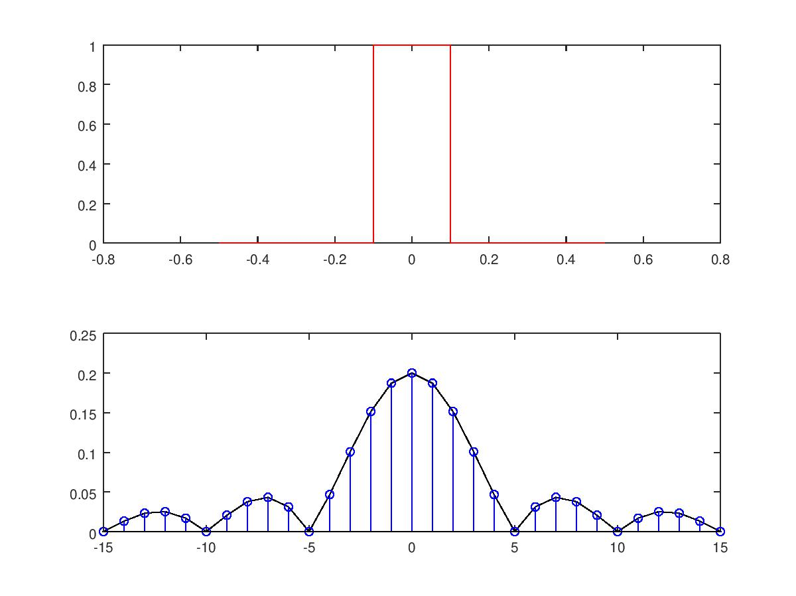
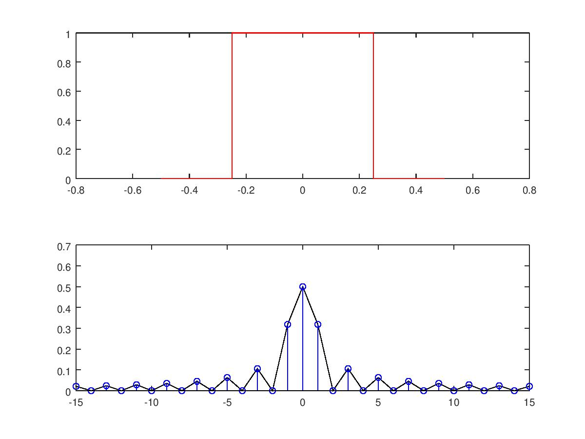
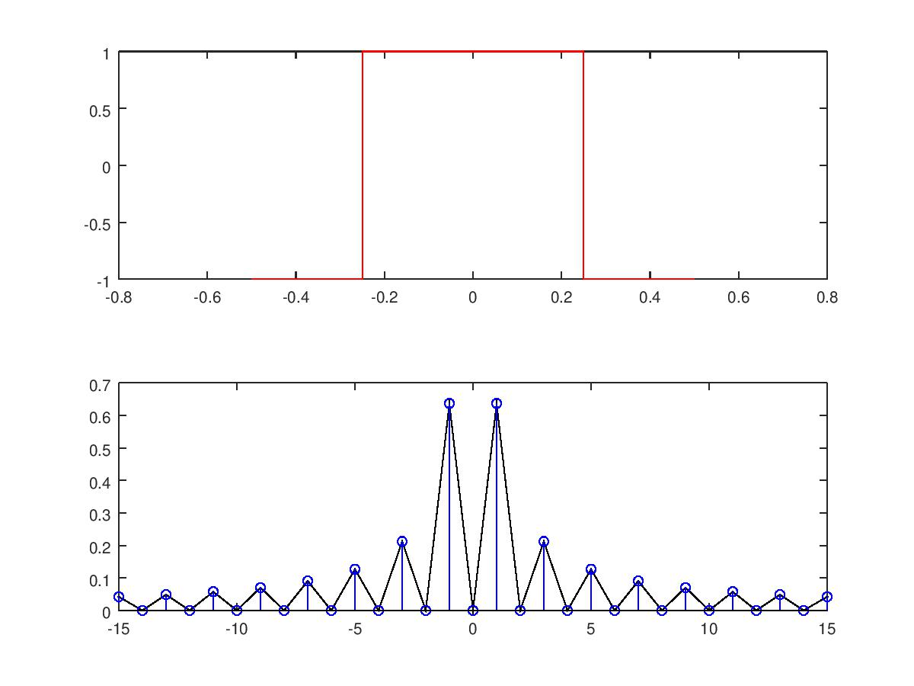
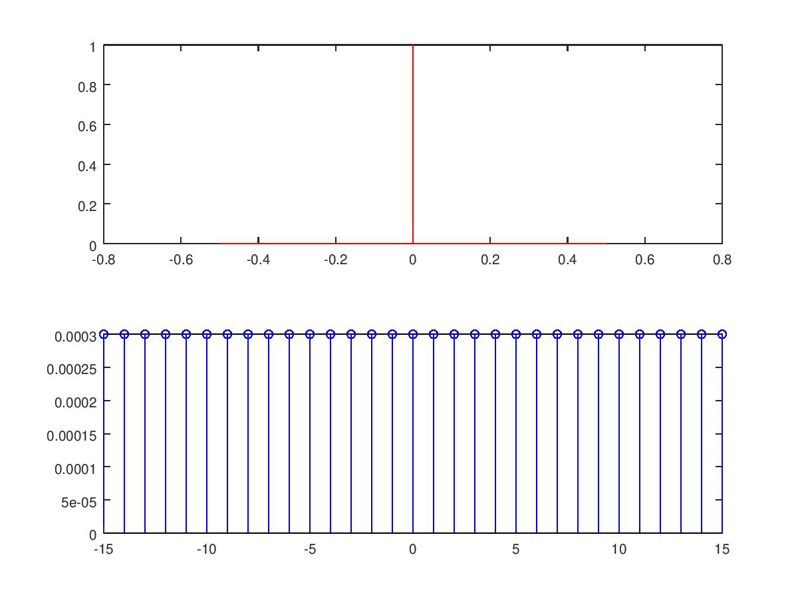
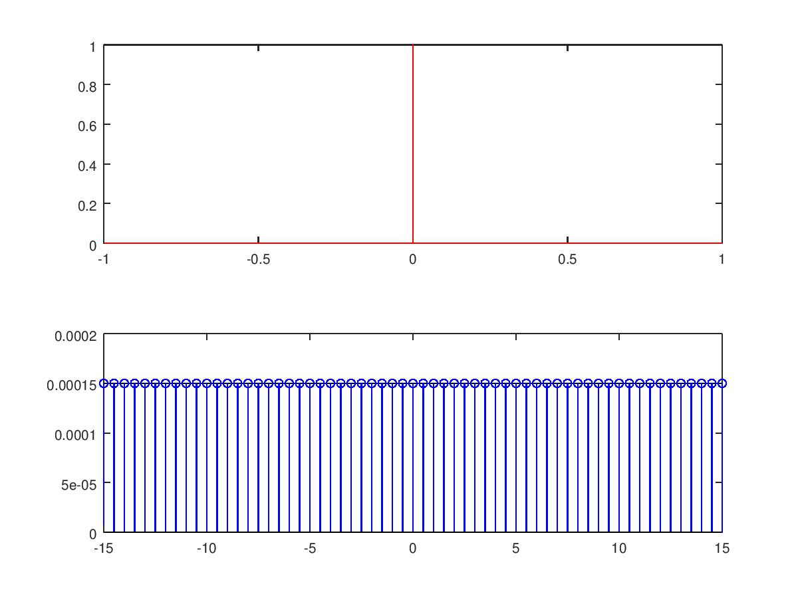

# Lezione del 11 aprile 2018

## Argomenti

* Scomposizione in serie di Fourier di un segnale reale
  * Finestratura del segnale - errori e approssimazioni
  * *Zero-padding*

## Lavagne



## Cosinusoide 0 Hz

[`comp0.m`](./comp0.m)
```matlab

fc = 1000;
pc = 1/fc;
dur = 0.1;

t = [0:pc:dur-pc];

freq = 0;

y = cos(freq*2*pi*t);

plot(t, y);
```


## Cosinusoide 0 Hz + Cosiusoide a f Hz

[`comp0_1.m`](./comp0_1.m)
```matlab

fc = 1000;
pc = 1/fc;
dur = 0.1;

t = [0:pc:dur-pc];

freq = 0;
f1 = 12;

y = (cos(freq*pi*2*t)+ cos(f1*2*pi*t))./2;

plot(t, y);
```


## window DFT

[Win1.m](./Win1.m)
```matlab

clear all
close all

sr = 10000; %Sample Rate
pc = 1/sr;

durBig = 1; %sec
durSmall = 0.1; % durata della finestra
SmallOffSet = 0.45; % inizio della finestra 

dSS = floor(durSmall*sr); %duarata in campioni della finstra (dur Small Sample)
dSO = floor(SmallOffSet*sr); %OffSet in campioni della finestra

t = [-durBig/2:pc:(durBig/2)-pc]; %array tempo

% generazione della finestra y 
y = zeros(1, size(t, 2));
y(dSO:dSO+dSS) = 1;

winSize = floor(durBig*sr);
binSize = sr/winSize;

F = [-winSize/2:binSize:(winSize/2)-binSize];

% DFT della finestra
for k = 1:size(F, 2);
fa = F(k)*2*pi;
za = e.^(-i*fa*t);
ya = y.*za;
dft(k) = abs(sum(ya))/size(ya, 2);
end

subplot(2, 1, 1)
plot(t, y, 'r')
subplot(2, 1, 2)
plot(F, dft, 'k')
hold on
stem(F, dft, 'b')
axis([-15 15 -0.01 0.1])
hold off
```


# Window DFT  (aumento del dutyCycle)
[Win2.m](./Win2.m)


[Win3.m](./Win3.m)


## Window DFT (bipolare)
[Win4.m](./Win4.m)


## Window DFT (impulso) 
[Win5.m](./Win5.m)

 
[Win6.m](./Win6.m)

