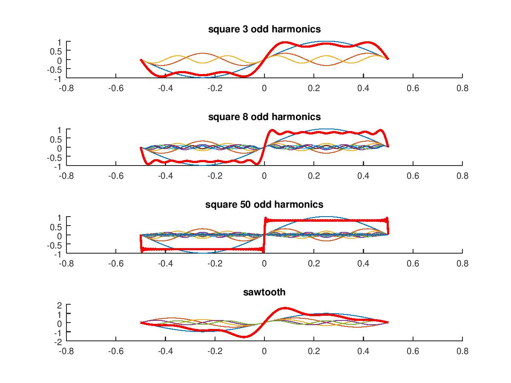
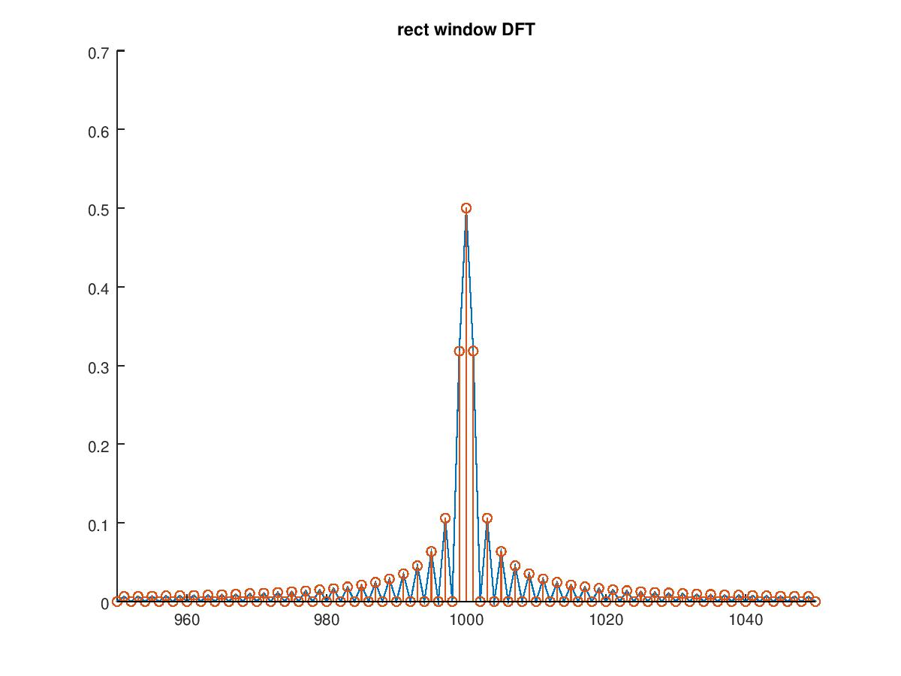
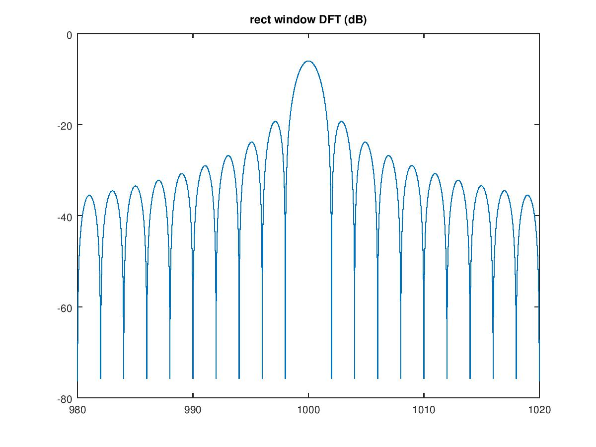

# Lezione del 18 aprile 2018

## Argomenti

* Scomposizione in serie di Fourier di un segnale reale
  * Finestratura del segnale - errori e approssimazioni
  * *Zero-padding*

## Lavagne

## Armoniche dell'onda quadra 

[`square0.m`](./square0.m)
```matlab
clear all
close all

fc = 10000;
pc = 1/fc;

dur = 1;

f = 1;

t = [-dur/2:pc:dur/2-pc];

s0 = zeros(1, length(t));
s1 = zeros(1, length(t));
s2 = zeros(1, length(t));
s3 = zeros(1, length(t));

subplot(4, 1, 1)
hold on
for k = 1:2:5
amp = 1/k;
c = amp*sin(2*pi*f*k*t);
p1 = plot(t, c);
set(p1, 'linewidth', 0.5)
s0 = s0.+c;
end
p2 = plot(t, s0, 'r');
set(p2, 'linewidth', 2);
title('square 3 odd harmonics')
hold off;

subplot(4, 1, 2)
hold on
for k = 1:2:15
amp = 1/k;
c = amp*sin(2*pi*f*k*t);
p1 = plot(t, c);
set(p1, 'linewidth', 0.5)
s1 = s1.+c;
end
p2 = plot(t, s1, 'r');
set(p2, 'linewidth', 2);
title('square 8 odd harmonics')
hold off;

subplot(4, 1, 3)
hold on
for k = 1:2:100;
amp = 1/k;
c = amp*sin(2*pi*f*k*t);
p1 = plot(t, c);
set(p1, 'linewidth', 0.5)
s2 = s2.+c;
end
p2 = plot(t, s2, 'r');
set(p2, 'linewidth', 2);
title('square 50 odd harmonics')
hold off;

subplot(4, 1, 4)
hold on
for k = 1:5
amp = 1/k;
c = amp*sin(2*pi*f*k*t);
p1 = plot(t, c);
set(p1, 'linewidth', 0.5)
s3 = s3.+c;
end
p2 = plot(t, s3, 'r');
set(p2, 'linewidth', 2);
title('sawtooth')
hold off;
```


## rect window DFT  

[`wDFT.m`](./wDFT.m)
```matlab
clear all;
close all;

fc = 10000;
pc = 1/fc;

durBig = 1;

t = [-durBig/2:pc:durBig/2-pc];

f = 1000;

p = cos(2*pi*f*t);

m = zeros(1, length(t));

nSamp = durBig*fc;
m(round(nSamp/4):round(nSamp/4*3)) = 1;

BinSize = 1; 
F = [-fc/2:BinSize:fc/2-BinSize];

out = m.*p;

for k = 1:length(F)
fa = F(k)*2*pi;
za = out.*e.^(-i*fa*t);
dft(k, 1) = (abs(sum(za))/length(t))*2;
end

hold on
plot(F, dft);
stem (F, dft);
axis([950 1050]);
title ('rect window DFT');
hold off
```


## rect window DFT (dB)

[wDFT1.m](./wDFT1.m)
```matlab
clear all;
close all;

fc = 10000;
pc = 1/fc;

durBig = 1;

t = [-durBig/2:pc:durBig/2-pc];

f = 1000;

p = cos(2*pi*f*t);

m = zeros(1, length(t));

nSamp = durBig*fc;
m(round(nSamp/4):round(nSamp/4*3)) = 1;

BinSize = 0.01; 
F = [-fc/2:BinSize:fc/2-BinSize];

out = m.*p;

side = 2000;
where = round((f+fc/2)/BinSize);


for k = where-side:where+side;
fa = F(k)*2*pi;
za = out.*e.^(-i*fa*t);
dft(1, k) = (abs(sum(za))/length(t))*2;
end

dftdB = 20*log10(dft);

plot(F(where-side:where+side), dftdB(where-side:end));
title('rect window DFT (dB)')
axis([980 1020])
```

