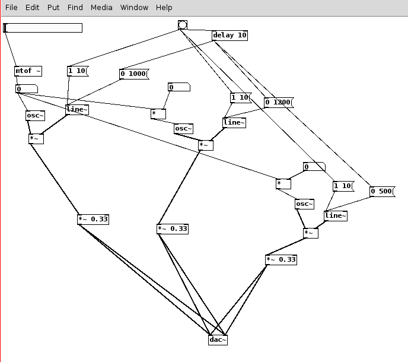
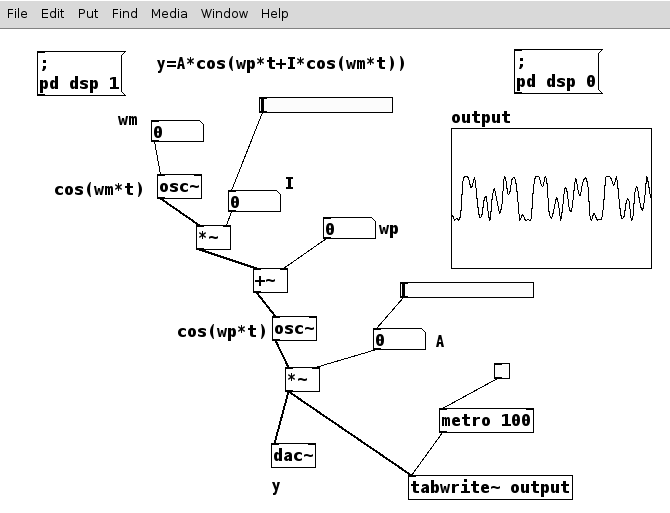

# Lezione del 12 settembre 2018

## Argomenti

* Ripasso delle tecniche di sintesi:
  * sintesi additiva
  * modulazione di frequenza
  * modulazione ad anello (solo introduzione)
* realizzazione di piccoli prototipi nei seguenti linguaggi:
  * `pure data`
  * `octave`
  * `csound`

## Lavagne


## Esempi (Prototipi)

### `Pure Data`

[Additiva.pd](./Additiva.pd)



[FM.pd](./FM.pd)



### `octave`

[osc.m](./osc.oct.m)

```matlab
t= [0: 0.001: 1];
f= 2;
wp= f*2*pi;
A= 0.8;
y= A*cos(wp*t);
plot(t,y)
figure(2)
stem(t,y)
```

[FM.m](./FM.oct.m)

```matlab
clear all
close all
t=[0: 0.0001: 1];
f=1000;
wp=f*2*pi;
A=0.8;
y= A*cos(wp*t);
plot(t,y)
figure(2)
stem(t,y)
wm=wp*3;
I=3;
Ix=I*(wp/(2*pi));
y=A*cos(wp*t+(Ix*cos(wm*t)));
figure (3)
plot (t,y)
F=[0: 10000];
Ft=fft(y);
figure (4)
plot (F, 2*abs(Ft)./size(t, 2))
axis([0 30])
```

### `csound`

[FM.csd](./FM.csd)

```csound
<CsoundSynthesizer>
<CsOptions>
-odac -d
</CsOptions>
<CsInstruments>

sr = 44100
ksmps = 10
nchnls = 1
0dbfs = 1
instr 1
ifreq= cpspch (p4)
kenv expon 1/3, p3, 0.01
kindex expon 0.1, p3, 3
aout foscil kenv, ifreq, 1, 3, kindex, 1
out aout
endin


</CsInstruments>
<CsScore>
f1 0 4096 10 1
i1 0 3 9.00
i1 1 13 9.01
i1 1.33 8 9.02

</CsScore>
</CsoundSynthesizer>
```
