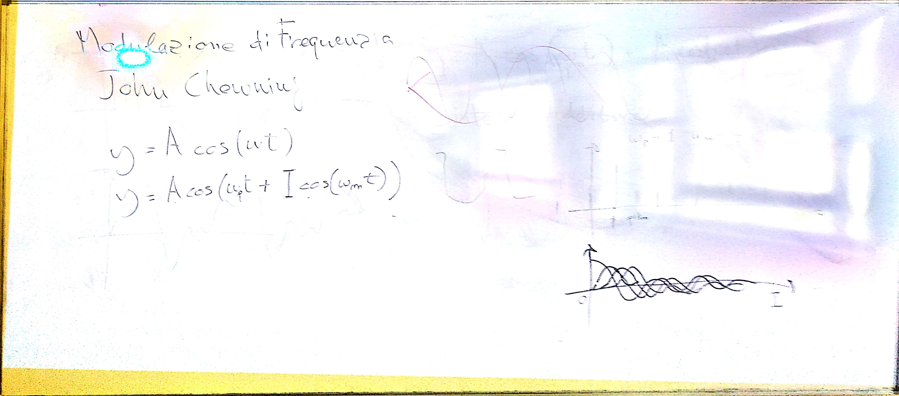

# Lezione del 12 settembre 2018

## Argomenti

* Ripasso delle tecniche di sintesi:
  * sintesi additiva
  * modulazione di frequenza
  * modulazione ad anello (solo introduzione)
* realizzazione di piccoli prototipi nei seguenti linguaggi:
  * `pure data`
  * `octave`
  * `csound`

## Lavagne

