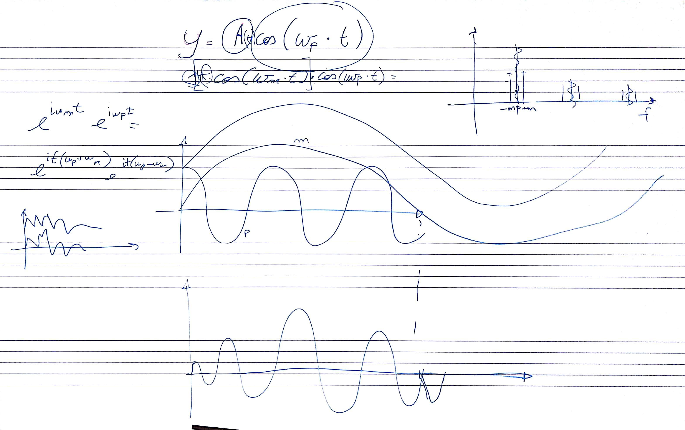
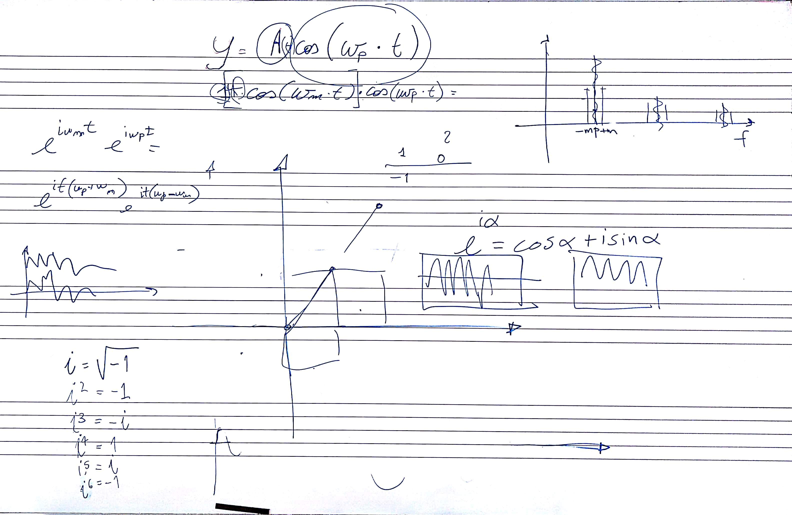
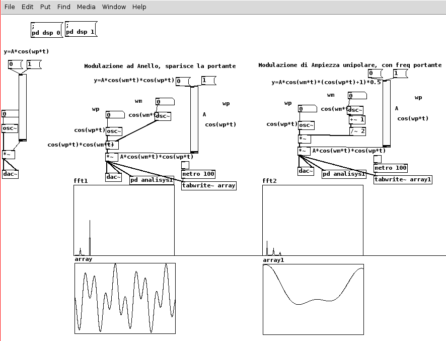
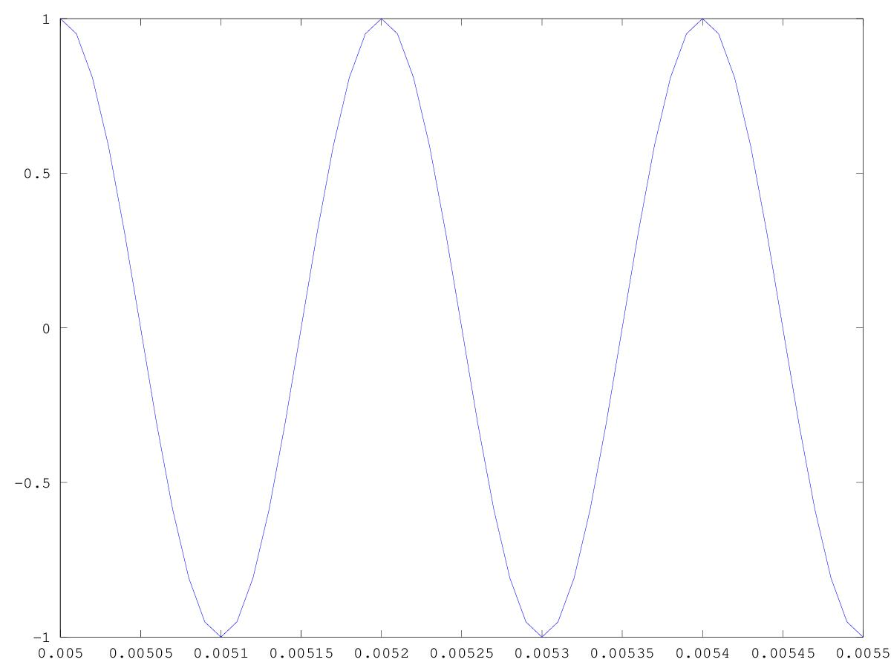
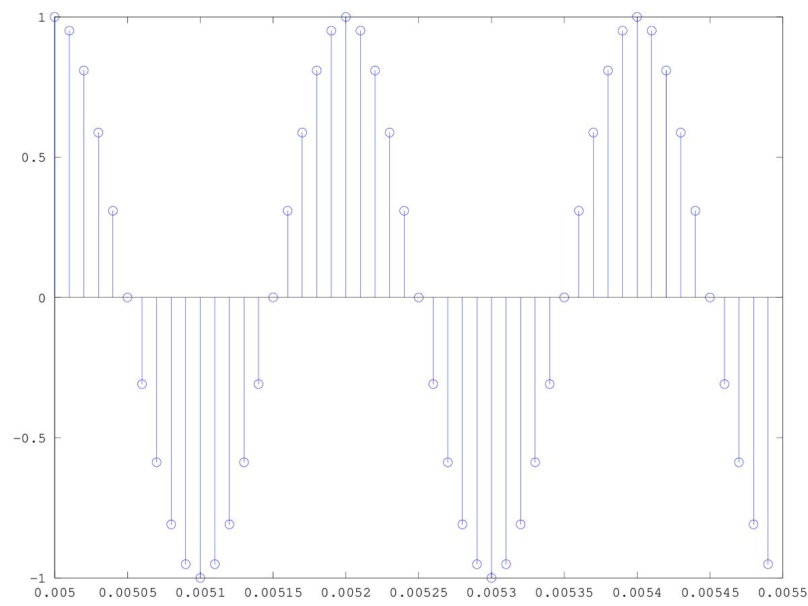
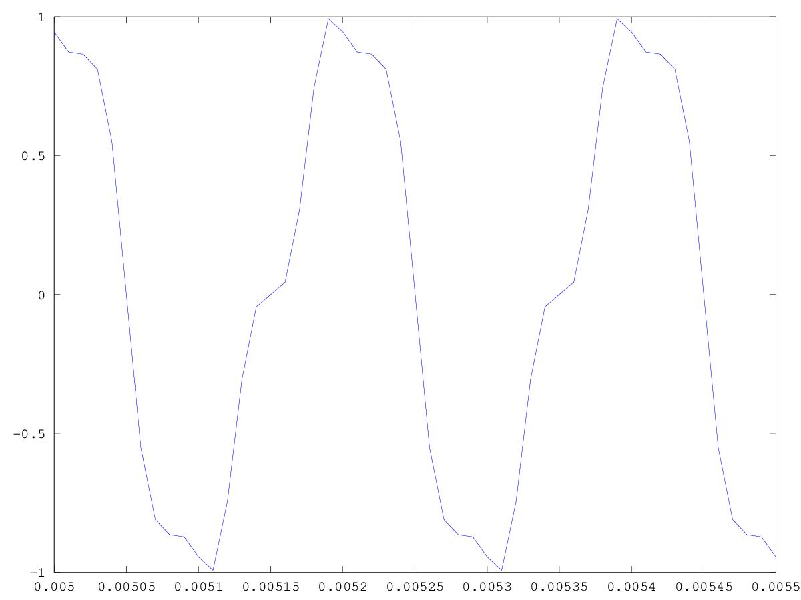
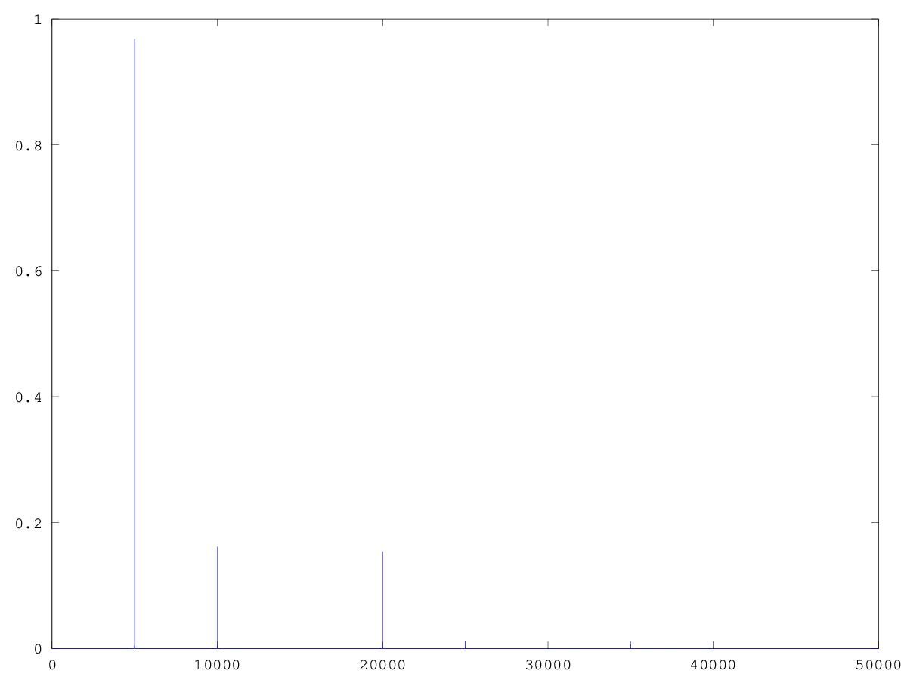
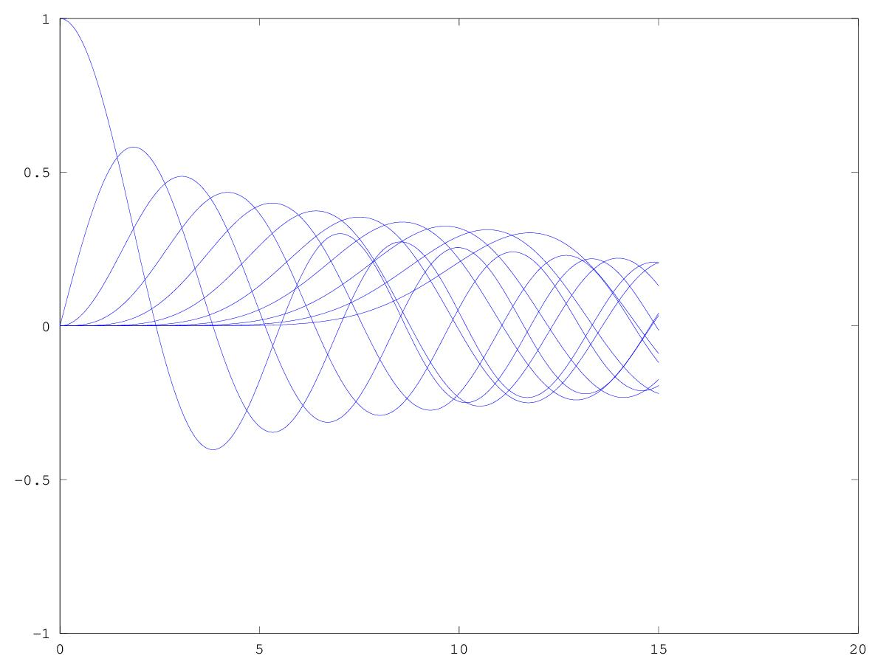

# Lezione del 8 ottobre 2018

## Argomenti

* Revisione dei numeri complessi
* Ripasso delle tecniche di sintesi:
  * Ripasso della modulazione di frequenza
  * modulazione ad anello
  * modulazione d'ampiezza
* realizzazione di piccoli prototipi nei seguenti linguaggi:
  * `pure data`
  * `octave`
  * `csound`

## Lavagne





## Esempi (Prototipi)

### `Pure Data`

[Ring modulation e Amplitude modulation](./RM+AM.pd)



### `Octave`

[Ripasso della modulazione di frequenza](./FM8ottobre.m)

```matlab
clear all
close all
t=[0:0.00001:1];%tempo di 1 sec con campionamento 1kHz
f=5000;%frequenza portante
wp=f*2*pi;% frequenza angolare
A=1;% ampiezza
y=A*cos(wp*t);% funzione onda
plot(t,y)%stampa funzione onda
figure (2)
stem (t,y)
wm=wp*3;%frequenza modulante
I=5000;%ampiezza  modulante
Ix=I/(wm/(2*pi))%%Si definisce indice di modulazione il rapporto tra ampiezza della modulante e la frequenza modulante
y=A*cos(wp*t+(Ix*cos(wm*t)));%modulazione FM
figure (3)
plot(t,y)
F=[0:100000];
Ft=fft(y);
figure (4)
plot(F,2*abs(Ft)./size (t,2))% componenti della FM
axis([0 30000])
figure(5)
idx=[0:0.01:15];
nbessel=10;%le armoniche di Bessel compaiono nello sviluppo in Serie di Fourier di un segnale modulato in frequenza (FM) quando il segnale di ingresso è una sinusoide.
hold on
for k=[0:nbessel];
plot(idx,besselj(k,idx))
endfor
hold off
```

questo script produce:










