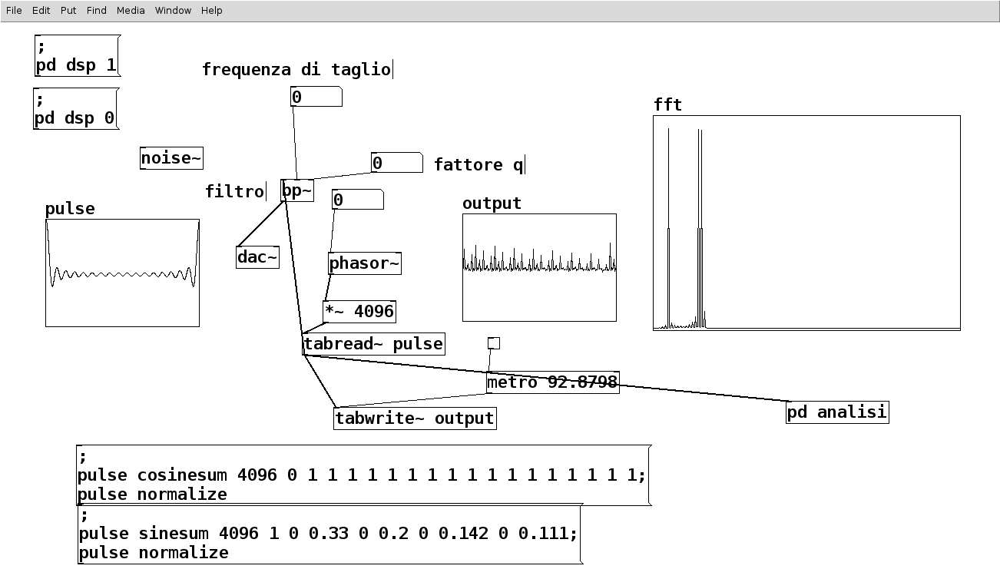
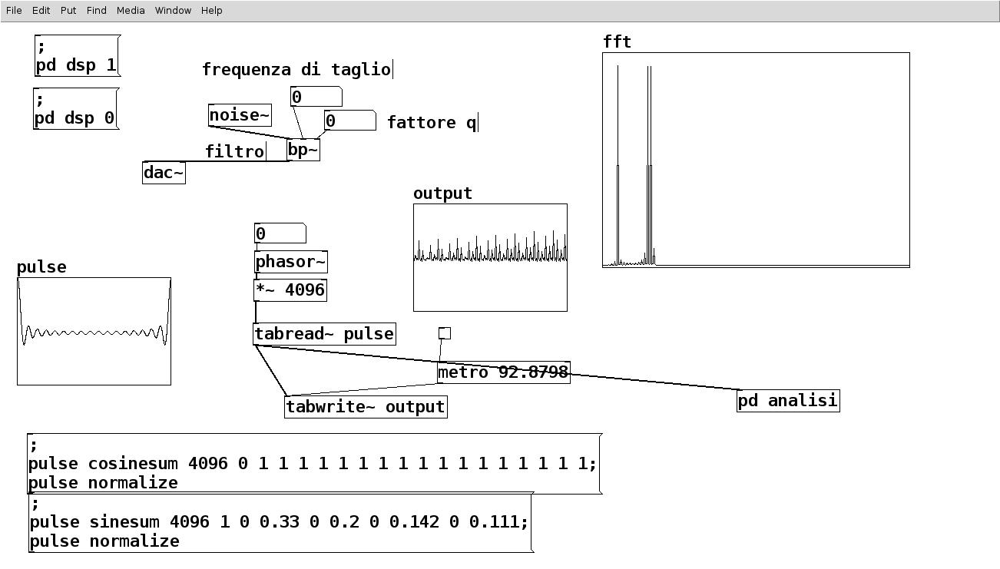
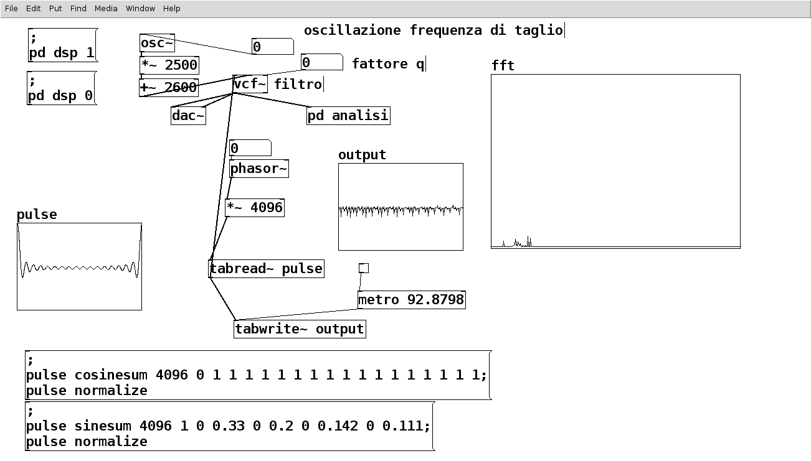
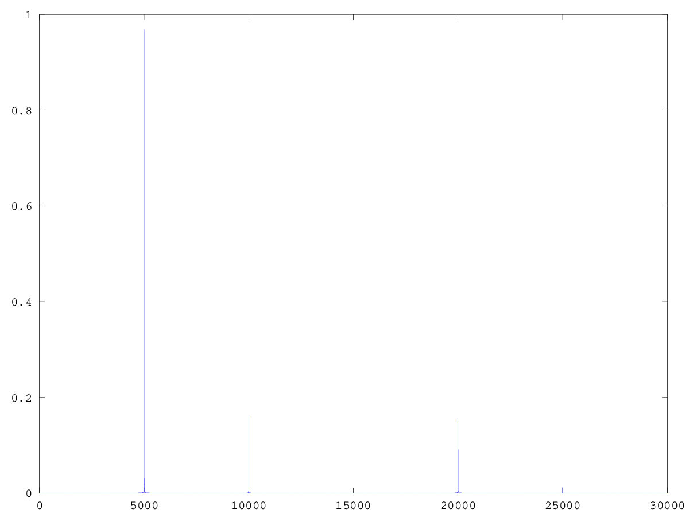
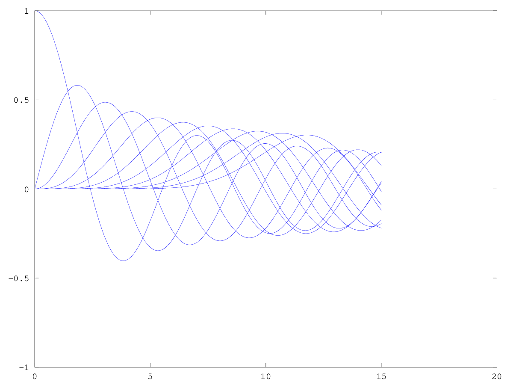
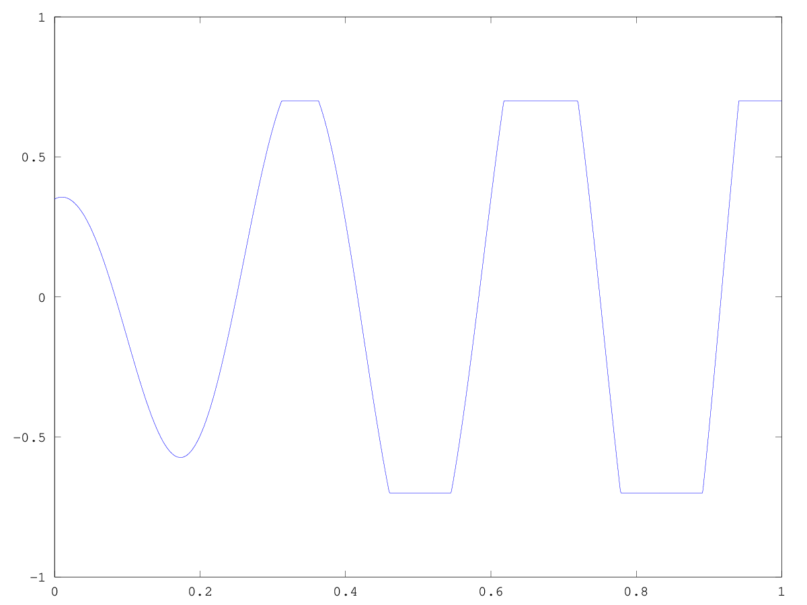
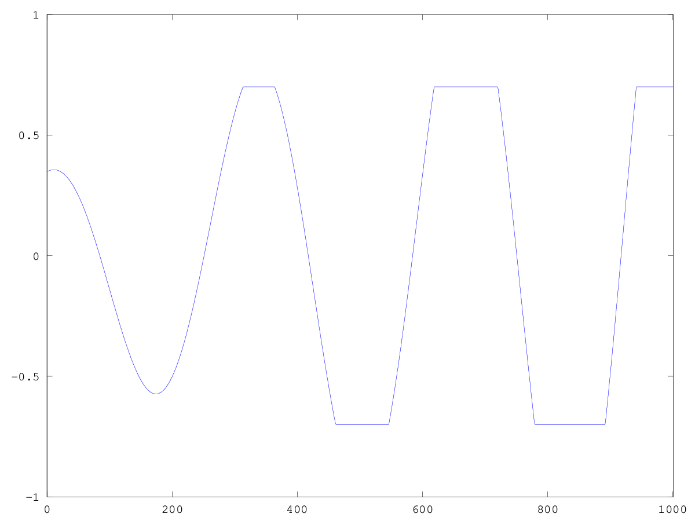
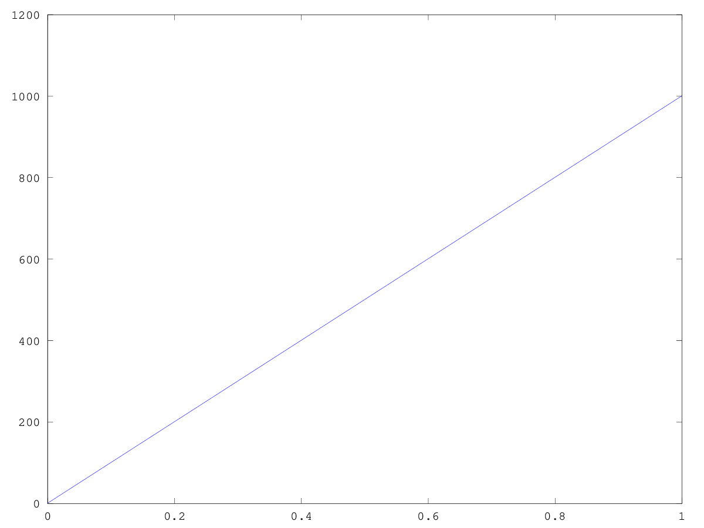
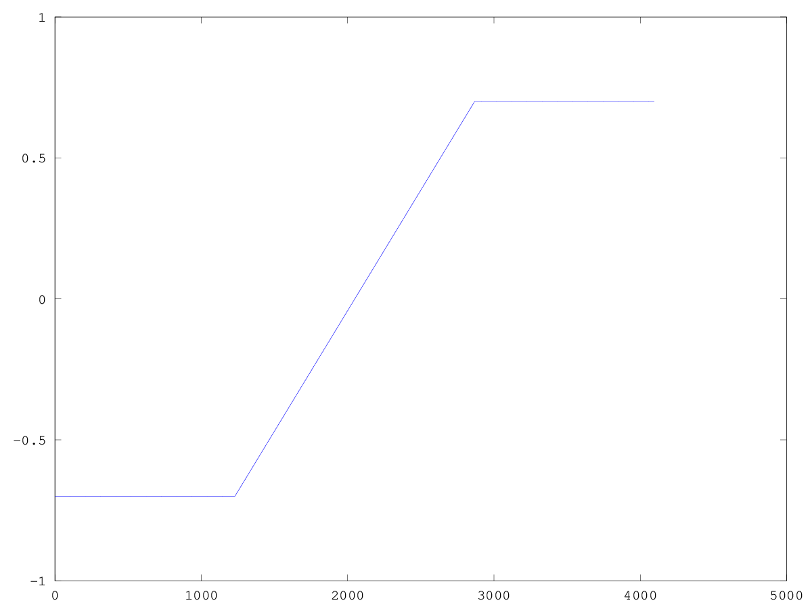

# Lezione del 10 ottobre 2018

## Argomenti

* Ripasso delle tecniche di sintesi:
  * Revisione dell'indice di modulazione della modulazione di frequenza
  * sintesi sottrattiva
  * sintesi per distorsione non-lineare
* realizzazione di piccoli prototipi nei seguenti linguaggi:
  * `pure data`
  * `octave`
  * `csound`

## Lavagne

<-!  ->

<-!  ->

## Esempi (Prototipi)

### `Pure Data`

[sintesi sottrattiva 1](./sottrattiva1.pd)



[sintesi sottrattiva 2](./sottrattiva2.pd)



[sintesi sottrattiva 3](./sottrattiva3.pd)



### `Octave`

[Revisione dell'indice della modulazione di frequenza](./FM10ottobre.m)

```matlab
clear all
close all
t=[0:0.00001:1];%tempo di 1 sec con campionamento 1kHz
f=5000;%frequenza portante
wp=f*2*pi;% frequenza angolare
A=1;% ampiezza
y=A*cos(wp*t);% funzione onda
%plot(t,y)%stampa funzione onda
%figure (2)
%stem (t,y)
wm=wp*3;%frequenza modulante
I=5000;%ampiezza  modulante
Ix=I/(wm/(2*pi))%%Si definisce indice di modulazione il rapporto tra ampiezza della modulante e la frequenza modulante
y=A*cos(wp*t+(Ix*cos(wm*t)));%modulazione FM
%figure (3)
%plot(t,y)
F=[0:100000];
Ft=fft(y);
figure (4)
plot(F,2*abs(Ft)./size (t,2))% componenti della FM
axis([0 30000])
figure(5)
idx=[0:0.01:15];
nbessel=10;%le armoniche di Bessel compaiono nello sviluppo in Serie di Fourier di un segnale modulato in frequenza (FM) quando il segnale di ingresso è una sinusoide.
hold on
for k=[0:nbessel];
plot(idx,besselj(k,idx))
endfor
hold off
```

questo script produce:





[Distorsione non lineare 1](./dnl1.m)

```matlab
t=[0:0.001:1];
A=1;
f=3;
w=f*2*pi;
x=A*cos(w*t);
%creiamo la tavola di distorsione
wsize=4096;%dimensione della tavola
afact=2/wsize;%step o fattore angolare y=afact*x
tav=[-1:afact:1-afact];%tavola
size (tav)
y=zeros(size(x));%creiamo una tavola vuota
p=zeros(size(x));%creiamo una tavola vuota
for k=1:size(t,2)
idx=round((x(k)*((wsize-1)/2))+((wsize-1)/2))+1;
y(k)=tav(idx);
p(k)=k;%
endfor
plot (t, y)%Uscita della tavola
figure(2)
plot (p, y)%Uscita della tavola con gli indici del fasore
figure(3)
plot (t, p)%uscita del fasore
```
[Distorsione non lineare 2](./dnl2.m)

```matlab
t=[0:0.001:1];
Astep = (0.95-0.2) / length(t);
A=[0.2:Astep:0.95-Astep];
f=3;
w=f*2*pi;
x=A.*cos(w*t);
%creiamo la tavola di distorsione
wsize=4096;%dimensione della tavola

dfact=0.7;
aletta=round((1-dfact)*wsize);
tavleft=ones(1,aletta)*-dfact;
tavright=ones(1,aletta)*+dfact;
afact=((dfact*2)/(wsize-(aletta*2)));%step o fattore angolare y=afact*x
tav=[tavleft [-dfact:afact:dfact-afact] tavright];%tavola
size (tav)
y=zeros(size(x));%creiamo una tavola vuota
p=zeros(size(x));%creiamo una tavola vuota
for k=1:size(t,2)
idx=round((x(k)*((wsize-1)/2))+((wsize-1)/2))+1;
y(k)=tav(idx);
p(k)=k;%
endfor
plot (t, y)%Uscita della tavola
axis([0 1 -1 1])
print("dnl2_1.png", "-dpng")
figure(2)
plot (p, y)%Uscita della tavola con gli indici del fasore
axis([0 1001 -1 1])
print("dnl2_2.png", "-dpng")
figure(3)
plot (t, p)%uscita del fasore
print("dnl2_3.png", "-dpng")
figure(4)
plot(tav)
print("dnl2_4.png", "-dpng")
```
Questo script produce i seguenti plot:








