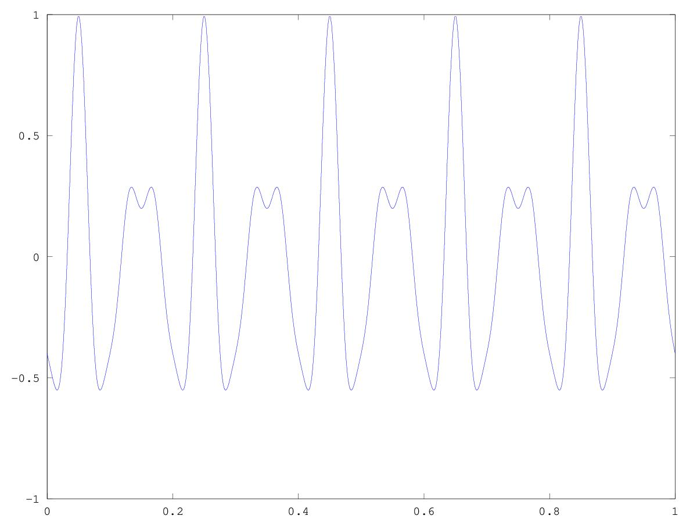

# Lezione del 31 ottobre 2018

## Argomenti

* Ripasso delle tecniche di sintesi:
  * sintesi per distorsione non-lineare
    * Funzioni di Chebychev
* realizzazione di piccoli prototipi nei seguenti linguaggi:
  * `pure data`
  * `octave`
  * `csound`

## Lavagne


## Esempi (Prototipi)


### `Octave`

[le prime dieci funzioni di Chebychev](./cheb1.m)

```matlab
x = [-1:0.001:1];

n = 10;

T = zeros(n, length(x));

T(1, :) = 1;

T(2, :) = x;

for k = 3 : n
T(k, :) = 2 * x.*T(k-1, :) - T(k-2, :);
endfor

plot(x, T)
```

questo script produce:


[Dimostrazione che la 4a funzione di Chebychev produce la 4a armonica](./cheb2.m)

```matlab
step = 0.001;
x = [-1:step:1];

n = 10;

T = zeros(n, length(x));

T(1, :) = 1;

T(2, :) = x;

for k = 3 : n
T(k, :) = 2 * x.*T(k-1, :) - T(k-2, :);
endfor

time = [0:step:1];

hSize = length(x)/2 - 1;

f = 1;

idx = round(hSize * sin(2*pi*f*time) + hSize) + 1;

plot(time, T(5, idx))
```

questo script produce:


[Composizione di funzioni di Chebychev](./cheb3.m)

```matlab
close all
clear all

step = 0.001;
x = [-1:step:1];

n = 10;

T = zeros(n, length(x));

T(1, :) = 1;

T(2, :) = x;

for k = 3 : n
T(k, :) = 2 * x.*T(k-1, :) - T(k-2, :);
endfor

Tc = 0.5 * T(3, :) .+ 0.3 * T(4, :) .+ 0.1 * T(5, :) .+ 0.1 * T(6, :);

figure(1)
plot(x, Tc);
grid on

time = [0:step:1];

hSize = length(x)/2 - 1;

f = 5;

idx = round(hSize * sin(2*pi*f*time) + hSize) + 1;

figure(2)
plot(time, Tc(idx))
```
Questo script produce i seguenti plot:



